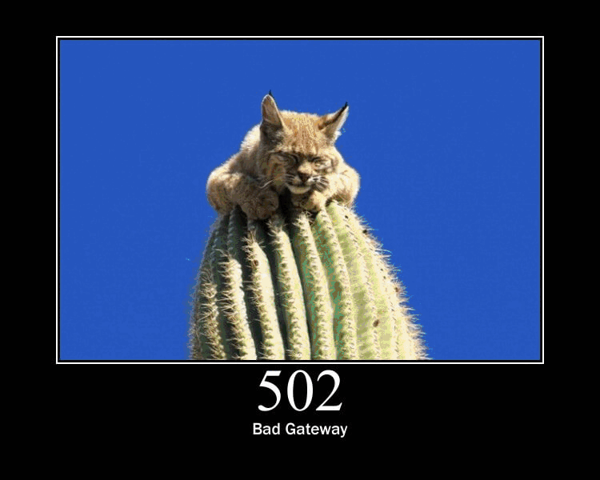

= Using Caffeine's `AsyncLoadingCache` in a Vert.x application
:page-permalink: /
:page-github: vertx-howtos/async-loading-cache-caffeine-howto

This document will show you how to use Caffeine's `AsyncLoadingCache` in a Vert.x application.

== What you will build

You will build an application that rotates images in a web page.

The images will be downloaded by the server from a public API exposed at https://http.cat.

Each image represents an HTTP status code as a 🐱.

Ready?

image::https://http.cat/100[width=600]

NOTE: Images created by Tomomi Imura (https://twitter.com/girlie_mac[@girlie_mac])

== What you need

* A text editor or IDE,
* Java 11 or higher,
* Maven or Gradle.

== Create a project

The code of this project contains Maven and Gradle build files that are functionally equivalent.

=== Using Maven

Here is the content of the `pom.xml` file you should be using:

[source,xml,role="collapsed"]
.Maven `pom.xml`
----
include::pom.xml[]
----

=== Using Gradle

Assuming you use Gradle with the Kotlin DSL, here is what your `build.gradle.kts` file should look like:

[source,kotlin,role="collapsed"]
.Gradle `build.gradle.kts`
----
include::build.gradle.kts[]
----

== Web Page Implementation

The `index.html` web page consists mainly of:

. an `` tag in the body, and
. a script that, after the page is loaded, changes the `src` attribute of the image.

[source,html]
.index.html
----
include::src/main/resources/webroot/index.html[]
----
<1> `img` tag in the body with `id` set to `cat-img`
<2> run the script function when the page is loaded
<3> define some HTTP status codes
<4> schedule a function to execute periodically at a fixed-delay of 250 milliseconds
<5> retrieve the `img` element from the DOM using its id
<6> update the `src` attribute using an HTTP status code chosen randomly

== Server Implementation

We will need a Vert.x Web Client instance to fetch images:

[source,java]
.Web Client setup
----
include::src/main/java/io/vertx/howtos/caffeine/CatsVerticle.java[tag=web-client]
----

We will also need a cache because we do not want to overload the backend API:

[source,java]
.Caffeine setup
----
include::src/main/java/io/vertx/howtos/caffeine/CatsVerticle.java[tag=caffeine]
----
<1> create a cache builder
<2> configure the cache to expire items after 1 minute
<3> enable statistics recording
<4> define an executor which invokes tasks on the verticle context
<5> create an asynchronous loader, which much return a `CompletableFuture`, using the cache executor
<6> fetch the cat image
<7> convert the Vert.x `Future` to a `CompletionStage`
<8> log cache statistics periodically

[NOTE]
====
The executor definition and the complex loader implementation are not strictly needed here.

Indeed, we will deploy a single verticle instance, bind the cache to a field and always invoke its methods from the event-loop.
If that is your use-case, you may simplify the setup to:

[source,java]
----
include::src/main/java/io/vertx/howtos/caffeine/CatsVerticle.java[tag=caffeine-simple]
----

If, however, you plan to deploy several instances of the verticle and to share the cache between them, stick to the previous implementation.
It guarantees that the asynchronous loader is always invoked on the right context.
====

Fetching the cat image consists in sending the request to the backend using the corresponding HTTP status code as URI:

[source,java]
.Fetching the image
----
include::src/main/java/io/vertx/howtos/caffeine/CatsVerticle.java[tag=fetch]
----

Using Vert.x Web, creating the HTTP server for our API and static file is pretty straightforward:

[source,java]
.Server setup
----
include::src/main/java/io/vertx/howtos/caffeine/CatsVerticle.java[tag=server]
----

Here is how we will implement image request handling:

[source,java]
.Handling image requests
----
include::src/main/java/io/vertx/howtos/caffeine/CatsVerticle.java[tag=handle-request]
----
<1> retrieve the specified code from the request path
<2> invoke Caffeine (the image will be loaded from the backend transparently, if needed)
<3> convert the `CompletableFuture` returned by Caffeine to a Vert.x `Future`
<4> on completion, send the image bytes (or the failure) to the client
<5> instruct the browser to disable caching of the image (otherwise, it would query our server only once for a given code!)

== Running the application

The `CatsVerticle` needs a `main` method:

[source,java]
.Main method
----
include::src/main/java/io/vertx/howtos/caffeine/CatsVerticle.java[tag=main]
----
<1> Create a Vert.x instance
<2> Deploy `CatsVerticle`

You can run the application from:

. your IDE, by running the `main` method from the `CatsVerticle` class, or
. with Maven: `mvn compile exec:java`, or
. with Gradle: `./gradlew run` (Linux, macOS) or `gradlew run` (Windows).

Browse to http://localhost:8080.

You should see the cat images rotating in the web page:

After some time, inspect the program output.
You should read something like:

----
Mar 22, 2022 3:45:17 PM io.vertx.howtos.caffeine.CatsVerticle lambda$start$4
INFO: Stats: CacheStats{hitCount=52, missCount=28, loadSuccessCount=28, loadFailureCount=0, totalLoadTime=2514949257, evictionCount=0, evictionWeight=0}
Mar 22, 2022 3:45:37 PM io.vertx.howtos.caffeine.CatsVerticle lambda$start$4
INFO: Stats: CacheStats{hitCount=132, missCount=28, loadSuccessCount=28, loadFailureCount=0, totalLoadTime=2514949257, evictionCount=0, evictionWeight=0}
Mar 22, 2022 3:45:57 PM io.vertx.howtos.caffeine.CatsVerticle lambda$start$4
INFO: Stats: CacheStats{hitCount=212, missCount=28, loadSuccessCount=28, loadFailureCount=0, totalLoadTime=2514949257, evictionCount=0, evictionWeight=0}
Mar 22, 2022 3:46:17 PM io.vertx.howtos.caffeine.CatsVerticle lambda$start$4
INFO: Stats: CacheStats{hitCount=267, missCount=53, loadSuccessCount=52, loadFailureCount=0, totalLoadTime=3337599348, evictionCount=28, evictionWeight=28}
Mar 22, 2022 3:46:37 PM io.vertx.howtos.caffeine.CatsVerticle lambda$start$4
INFO: Stats: CacheStats{hitCount=344, missCount=56, loadSuccessCount=56, loadFailureCount=0, totalLoadTime=3480880213, evictionCount=28, evictionWeight=28}
----

Notice the changes in `hitCount`, `missCount`, or `evictionCount`.

== Summary

This document covered:

. the Vert.x web client for making HTTP requests,
. the Vert.x web server and router,
. the integration of Caffeine's asynchronous loading cache in a Vert.x application,
. Vert.x periodic tasks.

== See also

- https://vertx.io/docs/vertx-core/java/[The Vert.x core APIs documentation]
- https://vertx.io/docs/vertx-web/java/[The Vert.x web documentation]
- https://vertx.io/docs/vertx-web-client/java/[The Vert.x web client documentation]
- https://github.com/ben-manes/caffeine/wiki/[The Caffeine project wiki]
